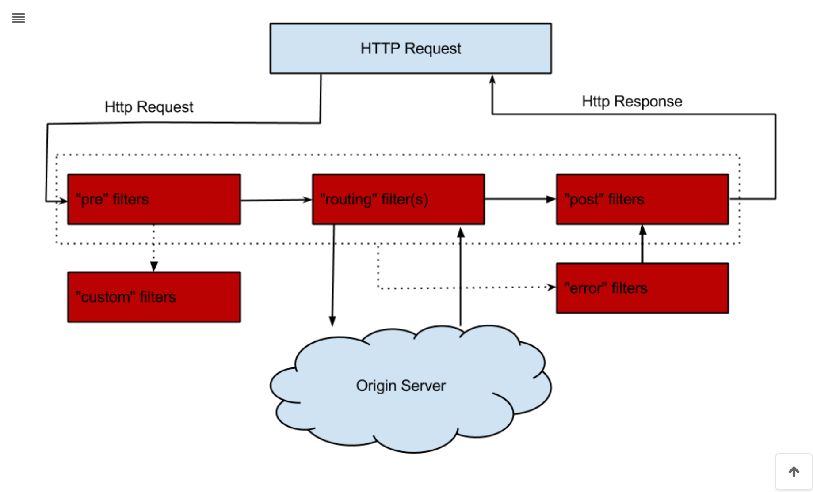
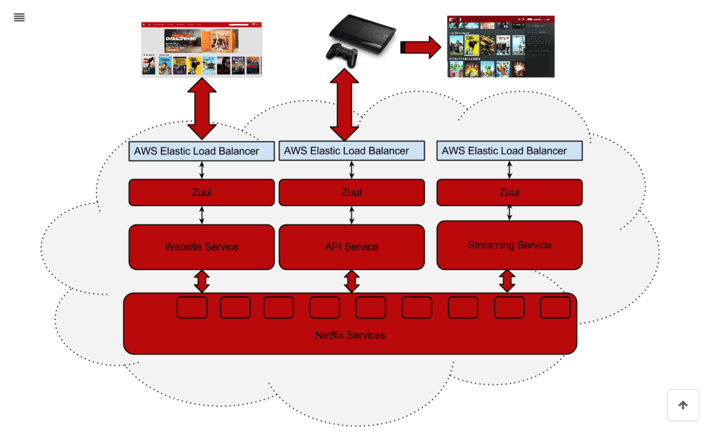

# Spring Cloud Zuul
在Spring Cloud体系中， Spring Cloud Zuul就是提供负载均衡、反向代理、权限认证的一个API gateway。  

## 一、框架理解
Spring Cloud Zuul路由是微服务架构的不可或缺的一部分，提供动态路由，监控，弹性，安全等的边缘服务。  
Zuul是Netflix出品的一个基于JVM路由和服务端的负载均衡器。

## 二、快速上手

1、添加依赖    
引入spring-cloud-starter-zuul包  
```xml
<!--引入网关依赖-->
<dependency>
    <groupId>org.springframework.cloud</groupId>
    <artifactId>spring-cloud-starter-netflix-zuul</artifactId>
</dependency>
<!--引入注册中心依赖-->
<dependency>
    <groupId>org.springframework.cloud</groupId>
    <artifactId>spring-cloud-starter-netflix-eureka-client</artifactId>
</dependency>
```
2、配置文件   
```yml
server:
  port: 18019
spring:
  application:
    name:  spring-cloud-zuul
# 网关会注册到注册中心
eureka:
  client:
    service-url:
      defaultZone: http://localhost:8888/eureka/
```
3、启动类  
在启动类上添加注解@EnableZuulProxy ，声明一个Zuul代理。  
该代理使用Ribbon来定位注册在Eureka Server中的微服务；  
同时，该代理还整合了 Hystrix,从而实现了容错，所有经过Zuul的请求都会在Hystrix命令中执行。  
```java
@EnableZuulProxy
@SpringBootApplication
public class Application {

    public static void main(String[] args) {
        SpringApplication.run(Application.class, args);
    }

}
```
4、测试步骤  
启动项目 注册中心 01-spring-cloud-eureka  
启用服务提供者 02-spring-cloud-server-provider  
启动服务消费者  04-spring-cloud-server-consumer-feign  
启动网关 20-spring-cloud-zuul  
测试访问 http://localhost:18019/server-provider/nice  
测试访问 http://localhost:18019/server-consumer-feign/nice  
5、解释说明
说明默认情况下，Zuul会代理所有注册到Eureka Server的微服务，并且Zuul的路由规则如下：  
http://ZUUL_HOST:ZUUL_PORT/微服务在Eureka 注册中心上的serviced/** 会被转发到 serviceld 对应的微服务。

## 三、管理端点

当@EnableZuulProxy与Spring Boot Actuator配合使用时,Zuul会暴露两个端点：  
一个路由管理端点/actuator/routes和/actuator/filters，借助这两个端点，可以方便、直观地查看以及管理Zuul的路由。
spring-cloud-starter-netflix-zuul已经包含了spring-boot-starter-actuator，因此不需再次引入  

1、修改application.yml,暴露端点  
```yml
management:
  endpoints:
    web:
      exposure:
        include: "*"
```

2、重启网关  
访问：http://localhost:18019/actuator/hystrix.stream 成功，  
说明已经zuul已经整合了hystrix。  

3、查看routes端点  
访问：http://localhost:8060/actuator/routes 可以查看路由设置。


4、查看filters端点  
访问：http://localhost:8060/actuator/filters 可以查看过滤器端点


5、解释说明  
从SpringCloud Edgware版本开始，Zuul提供了filters端点。  
访问该端点即可返回Zuul 中当前所有过滤器的详情，并按照类型分类。  
上面是filters端点的展示结果，从中，  
我们可以了解当前Zuul中，error、post、pre、route四种类型的过滤器分别有哪些，  
每个过滤器的order（执行顺序）是多少，以及是否启用等信息。这对Zul问题的定位很有用  

## 四、路由配置
1、配置重定向   
```yml
zuul:
  routes:
    path: /dwz/**
    url: http://www.ityouknow.com/
```
请访问 http://localhost:18019/dwz/spring-cloud

2、自定义指定微服务的访问路径  
配置zul.routes.指定微服务的serviceId=指定路径 即可。例如∶   
```yml
zuul:
  routes:
    server-provider: /server/**
```
请访问 http://localhost:18019/server/nice

3、忽略指定微服务  
忽略服务非常简单，可以使用zul.ignored-services配置需要忽略的服务，多个服间用逗号分隔。例如∶
```yml
zuul:
  ignored-services:  user-provider,consumer-movie
```
这样就可让Zuul忽略 user-provider和 consumer-movie微服务，只代理其他微服务。

4、忽略所有微服务，只路由指定微服务  
很多场景下，可能只想要让Zul代理指定的微服务，此时可以将zuul.ignored-services
设为’*’。  
```yml
zuul:
  ignored-services: '*'  #使用'*'可忽略所有微服务
  routes:
    server-provider: /server/**
```
这样就可以让Zul只路由server-provider微服务。

5、同时指定微服务的serviceld和对应路径。例如∶  
```yml
#该配置方式中，user-route只是给路由一个名称，可以任意起名。
zuul:
  routes:
    user-route:
      service-id: user-provider
      # service-id对应的路径
      path: /user/**
```

## 五、过滤器
过滤器是Zuul的核心组件

1、过滤器类型与请求生命周期   
Zuul大部分功能都是通过过滤器来实现的。Zuul中定义了4种标准过滤器类型，这些过滤器类型对应于请求的典型生命周期。  
- PRE：这种过滤器在请求被路由之前调用。可利用这种过滤器实现身份验证、在集群中选择请求的微服务、记录调试信息等。
- ROUTING：这种过滤器将请求路由到微服务。这种过滤器用于构建发送给微服务的请求,并使用Apache HttpClient或Netflix Ribbon请求微服务。
- POST：这种过滤器在路由到微服务以后执行。这种过滤器可用来为响应添加标准的 HTTP Header.收集统计信息和指标、将响应从微服务发送给客户端等。
- ERROR：在其他阶段发生错误时执行该过滤器。
除了默认的过滤器类型，Zuul还允许创建自定义的过滤器类型。例如，可以定制一种 STATIC类型的过滤器，直接在Zuul中生成响应，而不将请求转发到后端的微服务。

2、Zuul请求的生命周期如下图：



3、内置过滤器

| 类型  | 顺序 | 过滤器                  | 功能                       |
| :---- | :--- | :---------------------- | :------------------------- |
| pre   | -3   | ServletDetectionFilter  | 标记处理Servlet的类型      |
| pre   | -2   | Servlet30WrapperFilter  | 包装HttpServletRequest请求 |
| pre   | -1   | FormBodyWrapperFilter   | 包装请求体                 |
| route | 1    | DebugFilter             | 标记调试标志               |
| route | 5    | PreDecorationFilter     | 处理请求上下文供后续使用   |
| route | 10   | RibbonRoutingFilter     | serviceId请求转发          |
| route | 100  | SimpleHostRoutingFilter | url请求转发                |
| route | 500  | SendForwardFilter       | forward请求转发            |
| post  | 0    | SendErrorFilter         | 处理有错误的请求响应       |
| post  | 1000 | SendResponseFilter      | 处理正常的请求响应         |

4、禁用指定的Filter

可以在application.yml中配置需要禁用的filter，格式：

```yml
zuul:    
  FormBodyWrapperFilter:        
    pre:            
      disable: true
```


5、自定义Zuul过滤器

```java
public class MyFilter extends ZuulFilter {
    @Override
    String filterType() {
        return "pre"; //定义filter的类型，有pre、route、post、error四种
    }
    @Override
    int filterOrder() {
        return 10; //定义filter的顺序，数字越小表示顺序越高，越先执行
    }
    @Override
    boolean shouldFilter() {
        return true; //表示是否需要执行该filter，true表示执行，false表示不执行
    }
    @Override
    Object run() {
        return null; //filter需要执行的具体操作
    }
}
```

6、自定义Filter示例

我们假设有这样一个场景，因为**服务网关应对的是外部的所有请求**，为了避免产生安全隐患，我们需要对请求做一定的限制，比如请求中含有Token便让请求继续往下走，如果请求不带Token就直接返回并给出提示。

```java
public class TokenFilter extends ZuulFilter {
    private final Logger logger = LoggerFactory.getLogger(TokenFilter.class);
    @Override
    public String filterType() {
        return "pre"; // 可以在请求被路由之前调用
    }
    @Override
    public int filterOrder() {
        return 0; // filter执行顺序，通过数字指定 ,优先级为0，数字越大，优先级越低
    }
    @Override
    public boolean shouldFilter() {
        return true;// 是否执行该过滤器，此处为true，说明需要过滤
    }
    @Override
    public Object run() {
        RequestContext ctx = RequestContext.getCurrentContext();
        HttpServletRequest request = ctx.getRequest();
        logger.info("--->>> TokenFilter {},{}", request.getMethod(), request.getRequestURL().toString());
        String token = request.getParameter("token");// 获取请求的参数
        if (StringUtils.isNotBlank(token)) {
            ctx.setSendZuulResponse(true); //对请求进行路由
            ctx.setResponseStatusCode(200);
            ctx.set("isSuccess", true);
            return null;
        } else {
            ctx.setSendZuulResponse(false); //不对其进行路由
            ctx.setResponseStatusCode(400);
            ctx.setResponseBody("token is empty");
            ctx.set("isSuccess", false);
            return null;
        }
    }
}
```

将TokenFilter加入到请求拦截队列，在启动类中添加以下代码：

```java
@Bean
public MyTokenFilter myTokenFilter() {
    return new MyTokenFilter();
}
```

这样就将我们自定义好的Filter加入到了请求拦截中。

```
请访问 http://localhost:18019/server/nice
请访问 http://localhost:18019/server/nice?token=12341234
```

通过上面这例子我们可以看出，我们可以使用“PRE”类型的Filter做很多的验证工作，在实际使用中我们可以结合shiro、oauth2.0等技术去做鉴权、验证。

六、路由熔断

当我们的后端服务出现异常的时候，我们不希望将异常抛出给最外层，期望服务可以自动进行一降级。Zuul给我们提供了这样的支持。当某个服务出现异常时，直接返回我们预设的信息。

我们通过自定义的fallback方法，并且将其指定给某个route来实现该route访问出问题的熔断处理。主要继承ZuulFallbackProvider接口来实现，ZuulFallbackProvider默认有两个方法，一个用来指明熔断拦截哪个服务，一个定制返回内容。

```java
public interface ZuulFallbackProvider {
   /**
     * The route this fallback will be used for.
     * @return The route the fallback will be used for.
     */
    public String getRoute();
    /**
     * Provides a fallback response.
     * @return The fallback response.
     */
    public ClientHttpResponse fallbackResponse();
}
```

实现类通过实现getRoute方法，告诉Zuul它是负责哪个route定义的熔断。而fallbackResponse方法则是告诉 Zuul 断路出现时，它会提供一个什么返回值来处理请求。

后来Spring又扩展了此类，丰富了返回方式，在返回的内容中添加了异常信息，因此最新版本建议直接继承类`FallbackProvider` 。

我们以上面的02-spring-cloud-server-provider服务为例，定制它的熔断返回内容。

```java
package co.dianjiu.zuul.fallback;

import org.slf4j.Logger;
import org.slf4j.LoggerFactory;
import org.springframework.cloud.netflix.zuul.filters.route.FallbackProvider;
import org.springframework.http.HttpHeaders;
import org.springframework.http.HttpStatus;
import org.springframework.http.MediaType;
import org.springframework.http.client.ClientHttpResponse;
import org.springframework.stereotype.Component;

import java.io.ByteArrayInputStream;
import java.io.IOException;
import java.io.InputStream;


@Component
public class MyProviderFallback  implements FallbackProvider {
    private final Logger logger = LoggerFactory.getLogger(MyProviderFallback.class);

    @Override
    public String getRoute() {
        return "server-provider";
    }

    @Override
    public ClientHttpResponse fallbackResponse(String route, Throwable cause) {
        if (cause != null && cause.getCause() != null) {
            String reason = cause.getCause().getMessage();
            logger.info("Excption {}",reason);
        }
        return fallbackResponse();
    }

    public ClientHttpResponse fallbackResponse() {
        return new ClientHttpResponse() {
            @Override
            public HttpStatus getStatusCode() throws IOException {
                return HttpStatus.OK;
            }
            @Override
            public int getRawStatusCode() throws IOException {
                return 200;
            }
            @Override
            public String getStatusText() throws IOException {
                return "OK";
            }
            @Override
            public void close() {
            }
            @Override
            public InputStream getBody() throws IOException {
                return new ByteArrayInputStream("The service is unavailable.".getBytes());
            }
            @Override
            public HttpHeaders getHeaders() {
                HttpHeaders headers = new HttpHeaders();
                headers.setContentType(MediaType.APPLICATION_JSON);
                return headers;
            }
        };
    }

}
```

当服务出现异常时，打印相关异常信息，并返回”The service is unavailable.”。

> Zuul 目前只支持服务级别的熔断，不支持具体到某个URL进行熔断。

## 六、路由重试

有时候因为网络或者其它原因，服务可能会暂时的不可用，这个时候我们希望可以再次对服务进行重试，Zuul也帮我们实现了此功能，需要结合Spring Retry 一起来实现。下面我们以上面的项目为例做演示。

**添加Spring Retry依赖**

首先在spring-cloud-zuul项目中添加Spring Retry依赖。

```xml
<dependency>
    <groupId>org.springframework.retry</groupId>
    <artifactId>spring-retry</artifactId>
</dependency>
```

```yml
zuul:
  ignored-services: '*'  #使用'*'可忽略所有微服务
  routes:
    server-provider: /server/**
  retryable: true #是否开启重试功能

ribbon:
  MaxAutoRetries: 2  #对当前服务的重试次数
  MaxAutoRetriesNextServer: 0 #切换相同Server的次数
```

**注意**

开启重试在某些情况下是有问题的，比如当压力过大，一个实例停止响应时，路由将流量转到另一个实例，很有可能导致最终所有的实例全被压垮。说到底，断路器的其中一个作用就是防止故障或者压力扩散。用了retry，断路器就只有在该服务的所有实例都无法运作的情况下才能起作用。这种时候，断路器的形式更像是提供一种友好的错误信息，或者假装服务正常运行的假象给使用者。

不用retry，仅使用负载均衡和熔断，就必须考虑到是否能够接受单个服务实例关闭和eureka刷新服务列表之间带来的短时间的熔断。如果可以接受，就无需使用retry。


## 七、高可用



我们实际使用Zuul的方式如上图，不同的客户端使用不同的负载将请求分发到后端的Zuul，Zuul在通过Eureka调用后端服务，最后对外输出。因此为了保证Zuul的高可用性，前端可以同时启动多个Zuul实例进行负载，在Zuul的前端使用Nginx或者F5进行负载转发以达到高可用性。