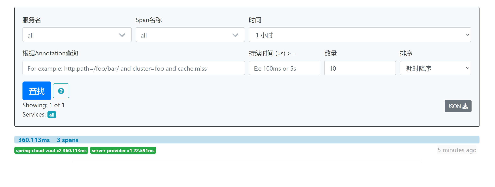
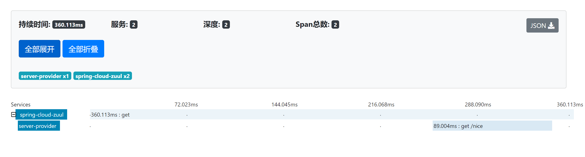
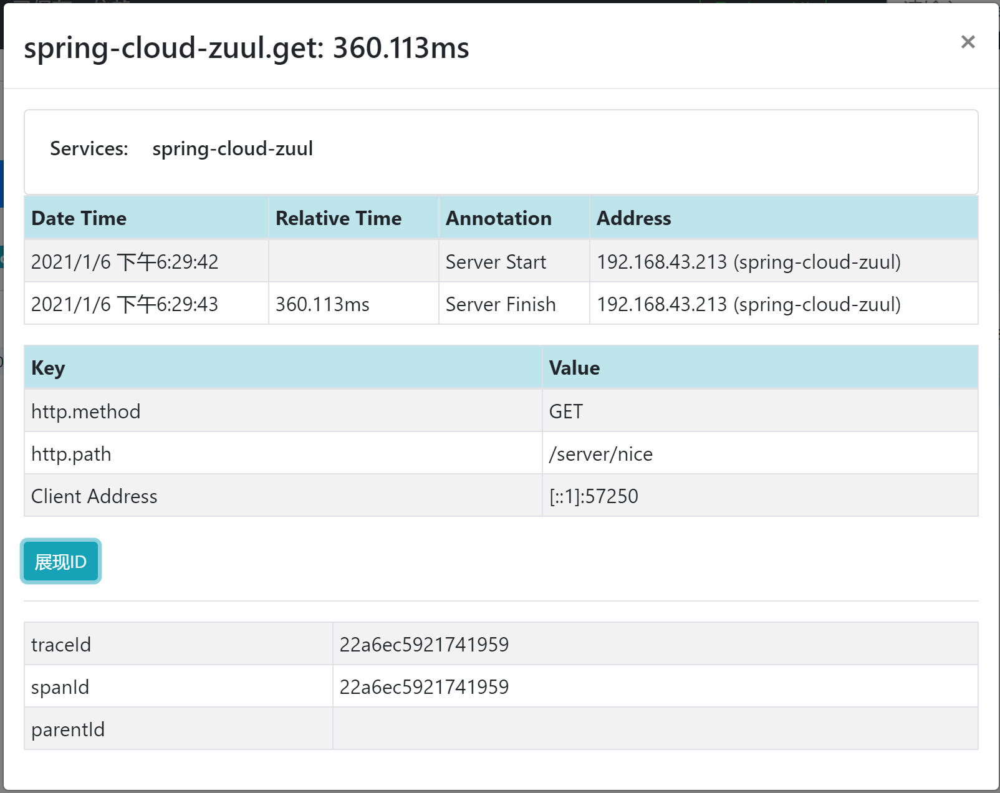
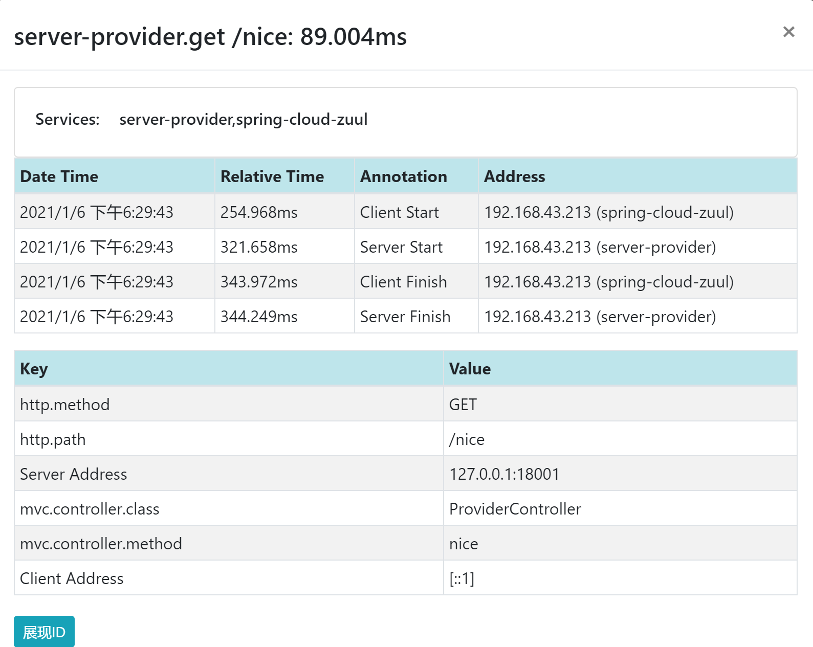
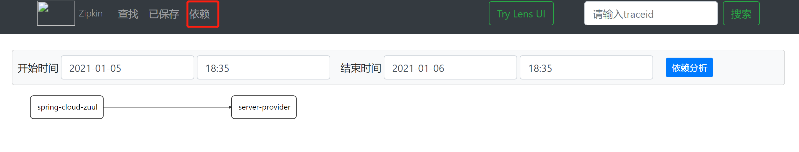

## ZipKin

Zipkin 是一个开放源代码分布式的跟踪系统，由Twitter公司开源，它致力于收集服务的定时数据，以解决微服务架构中的延迟问题，包括数据的收集、存储、查找和展现。

每个服务向zipkin报告计时数据，zipkin会根据调用关系通过Zipkin UI生成依赖关系图，显示了多少跟踪请求通过每个服务，该系统让开发者可通过一个 Web 前端轻松的收集和分析数据，例如用户每次请求服务的处理时间等，可方便的监测系统中存在的瓶颈。

Zipkin提供了可插拔数据存储方式：In-Memory、MySql、Cassandra以及Elasticsearch。接下来的测试为方便直接采用In-Memory方式进行存储，生产推荐Elasticsearch。

## 1、启动服务端

springboot 2.0 以上不支持单独集成

点击链接下载

链接：https://pan.baidu.com/s/1bfEfuc8Cdf0UFx6TJlf1xw 
提取码：uaex 
复制这段内容后打开百度网盘手机App，操作更方便哦--来自百度网盘超级会员V4的分享

```
java -jar zipkin-server-2.12.9-exec.jar
```


## 2、项目添加zipkin支持

在项目`spring-cloud-producer`和`spring-cloud-zuul`中添加zipkin的支持。

```xml
<dependency>
    <groupId>org.springframework.cloud</groupId>
    <artifactId>spring-cloud-starter-zipkin</artifactId>
</dependency>
```

Spring应用在监测到Java依赖包中有sleuth和zipkin后，会自动在RestTemplate的调用过程中向HTTP请求注入追踪信息，并向Zipkin Server发送这些信息。

同时配置文件中添加如下代码：

```
spring:
  zipkin:
    base-url: http://localhost:9411
  sleuth:
    sampler:
      percentage: 1.0
```

## 3、测试

http://localhost:18019/server/nice?token=12341234









